# Praxis Chess — Architecture & Design

> A personal chess improvement platform that syncs games from Chess.com, analyzes mistakes
> using Stockfish + a local LLM, identifies patterns across your portfolio, and generates
> a personalized training plan. Everything runs locally — no cloud AI calls.

---

## Table of Contents

1. [Design Principles](#design-principles)
2. [System Overview](#system-overview)
3. [Tech Stack](#tech-stack)
4. [High-Level Architecture](#high-level-architecture)
5. [Data Model](#data-model)
6. [Sync Pipeline](#sync-pipeline)
7. [Analysis Pipeline](#analysis-pipeline)
8. [AI Reasoning Flow](#ai-reasoning-flow)
9. [Pattern Aggregation](#pattern-aggregation)
10. [Frontend Architecture](#frontend-architecture)
11. [Backend Architecture](#backend-architecture)
12. [Progress Tracking](#progress-tracking)
13. [Key Design Decisions](#key-design-decisions)
14. [REST API Reference](#rest-api-reference)
15. [Non-Functional Considerations](#non-functional-considerations)
16. [Future Considerations](#future-considerations)
17. [Hardware Reality](#hardware-reality)
18. [How It All Connects (High Level)](#how-it-all-connects-high-level)

---

## Design Principles

These principles guided every major decision in the system design.

### 1. Structured outputs over free text
The LLM is always asked for strict JSON with a predefined schema. Free-form prose
would require parsing heuristics that break unpredictably. `OllamaAnalysisClient`
sets `"format": "json"` at the API level (Ollama JSON mode) and also strips markdown
code fences in case the model wraps its output anyway.

### 2. LLM analyzes; it does not orchestrate
The LLM receives data and returns an analysis. It never decides what to do next,
calls tools, or drives any control flow. Stockfish determines *which* positions to
analyze; the LLM only explains *why* a move was a mistake.

### 3. Offline by design
No cloud AI, no external analysis APIs. Ollama runs locally, Stockfish is a local
binary. The only external call is the Chess.com public REST API to fetch PGN data.
The system works with no internet connection after initial game sync.

### 4. Aggregate, don't just report
The system doesn't stop at identifying individual mistakes. It aggregates all errors
across an entire game library into statistical distributions (by phase, move range,
motif, opening) and asks the LLM to identify systemic patterns — weaknesses that
appear across many games, not just a single bad game.

### 5. Persistence-first
Every intermediate result (games, move errors, patterns, training plan) is persisted
to PostgreSQL. Analysis is expensive (35–50 min for 74 games); the results must
survive a server restart. The one current exception is the in-memory progress tracker,
which is intentionally ephemeral to avoid per-update DB writes.

---

## System Overview

Praxis has three independent data pipelines that run sequentially:

```
Chess.com API  →  Sync Pipeline  →  Analysis Pipeline  →  Pattern Aggregation
                    (fetch PGN)      (Stockfish + LLM)      (LLM summary + plan)
```

Each pipeline can be triggered manually. Results are stored in PostgreSQL and served
to the React frontend via a Spring Boot REST API.

---

## Tech Stack

| Layer | Technology | Version |
|---|---|---|
| Frontend | React + TypeScript + Vite | React 18 |
| Server state | TanStack Query | v5 |
| Chess rendering | react-chessboard | latest |
| Chess logic (FE) | chess.js | latest |
| Backend | Spring Boot | 3.5.3 |
| Language | Java | 26 |
| ORM | Hibernate / Spring Data JPA | 6.6 |
| Database | PostgreSQL (Docker) | 17 |
| Chess engine | Stockfish | AVX2 binary |
| Chess parsing (BE) | chesslib | 1.3.3 |
| Local LLM runtime | Ollama | latest |
| LLM model | qwen2.5:7b | 7B params |
| Async executor | Spring `@Async` + `ThreadPoolTaskExecutor` | — |

---

## High-Level Architecture

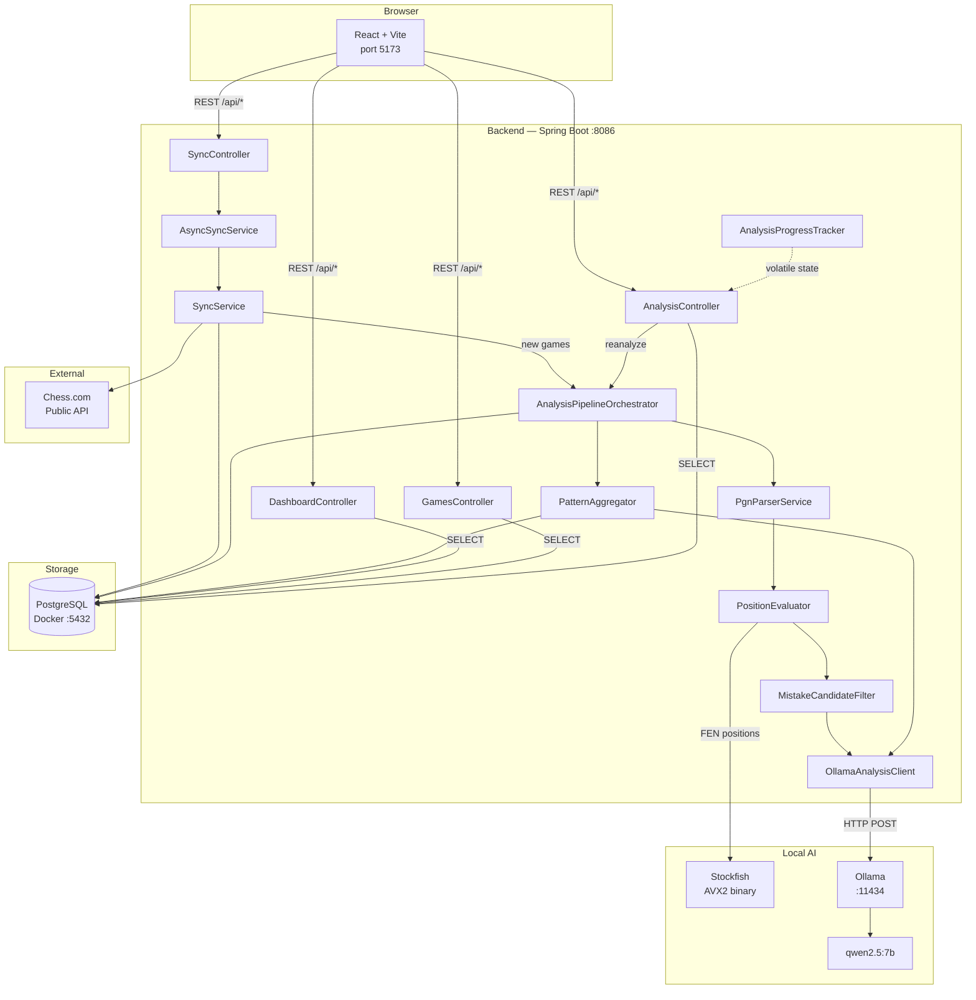

---

## Data Model

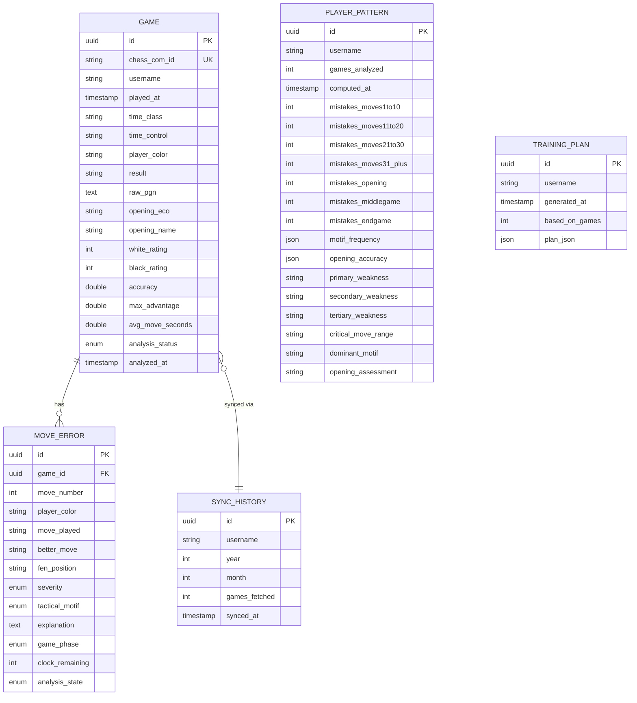

**Key database indexes:**

```sql
-- Query performance for the most frequent access patterns
CREATE INDEX idx_games_username          ON games(username);
CREATE INDEX idx_games_analysis_status  ON games(username, analysis_status);
CREATE INDEX idx_move_errors_game_id    ON move_errors(game_id);
CREATE INDEX idx_move_errors_severity   ON move_errors(severity);
CREATE INDEX idx_move_errors_motif      ON move_errors(tactical_motif);
CREATE INDEX idx_player_patterns_user   ON player_patterns(username);
```

**Analysis status lifecycle:**

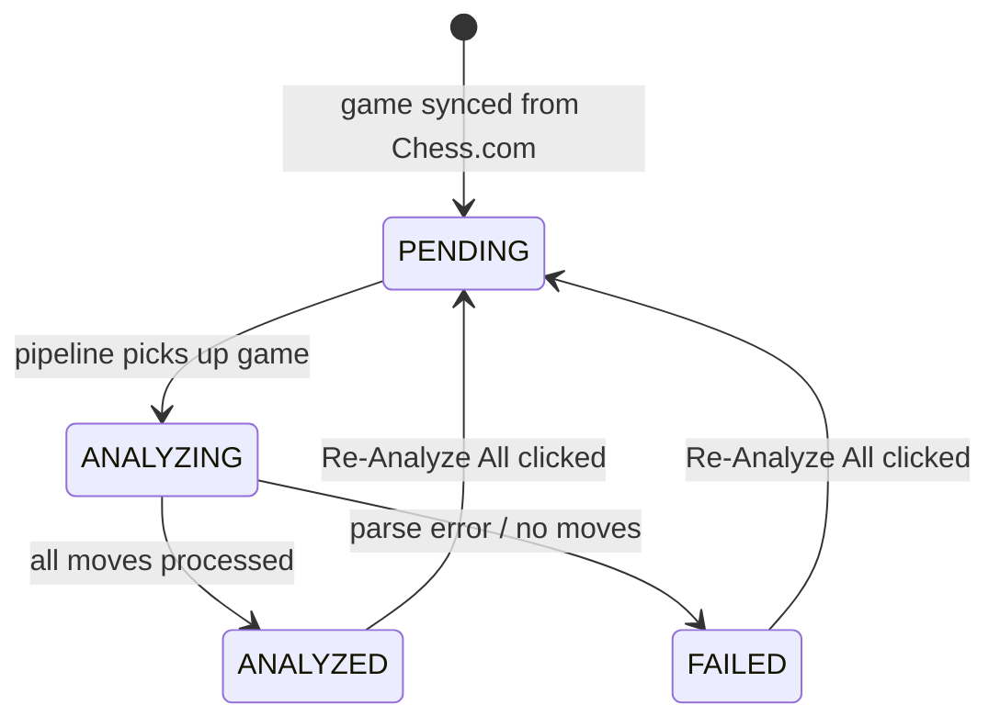

---

## Sync Pipeline

Triggered by **Sync Now** (new months only) or **Re-Sync** (forces re-check of last 3 months).

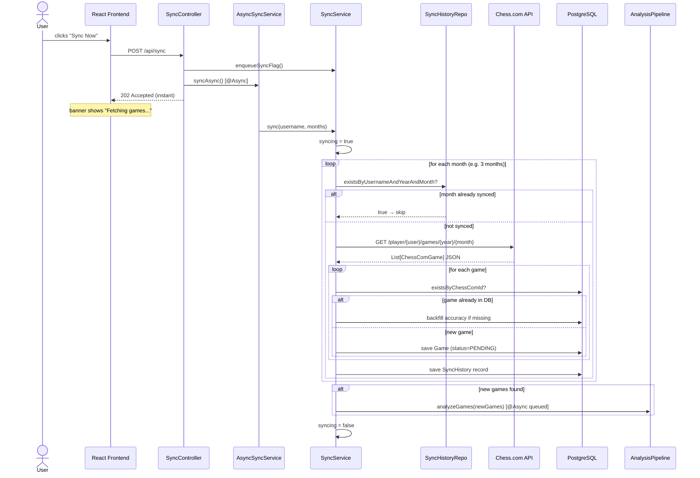

**Re-Sync** additionally calls `clearSyncHistory()` before `sync()`, forcing all months
to be re-fetched from Chess.com regardless of prior sync history. Only games with a new
`chess_com_id` (not already in the DB) are inserted.

### Chess.com API Details

| Endpoint | Used for |
|---|---|
| `GET https://api.chess.com/pub/player/{username}/games/{year}/{month}` | Fetch all games for a calendar month |
| `GET https://api.chess.com/pub/player/{username}/stats` | Player rating history (used by Dashboard) |

**Important constraints:**
- A `User-Agent` header is required on every request; Chess.com returns 403 without it.
- Requests must be made serially — parallel requests trigger 429 rate limiting.
- The API returns HTTP 304 Not Modified if the month hasn't changed since the last fetch;
  the `SyncHistory` table's year/month deduplication makes this largely a non-issue.

---

## Analysis Pipeline

The core pipeline. Runs asynchronously on a single-threaded executor so Stockfish and
Ollama are never called concurrently.

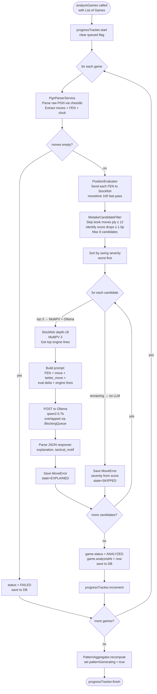

### Key thresholds (MistakeCandidateFilter)

| Parameter | Value | Meaning |
|---|---|---|
| `MISTAKE_THRESHOLD` | 1.0 pawns | Minimum score drop to be flagged |
| `BLUNDER_THRESHOLD` | 2.0 pawns | Score drop that classifies as a blunder |
| `TIME_PRESSURE_CUTOFF` | 30 seconds | Clock remaining below this → time pressure flag |
| `MAX_CANDIDATES` | 8 per game | Upper bound on mistakes identified |
| `BOOK_MOVES_PLY` | 12 ply (6 full moves) | Opening moves skipped — engine evals are near-equal and noisy |
| `MAX_OLLAMA_CALLS_PER_GAME` | 3 per game | Ollama only called for the 3 worst mistakes |

### Why only 3 Ollama calls per game?

Each Ollama call takes 7–16 seconds. With 74 games × 3 calls = 222 Ollama calls ≈ 35–50 minutes total.
Remaining mistakes (up to 5 more) are saved without natural language explanation to preserve
pattern count accuracy without multiplying inference time.

---

## AI Reasoning Flow

Three separate AI calls happen across the full pipeline, each using `qwen2.5:7b` via Ollama.

### Call 1 — Per-Move Analysis (×3 per game)

**Input prompt:**
```
You are a chess coach. Explain concisely why the played move is worse than the engine's move.
Do NOT suggest moves — the engine move is already determined.

Position (FEN): rnbqkbnr/pppp1ppp/8/4p3/4P3/5N2/PPPP1PPP/RNBQKB1R b KQkq - 1 2
Move played: Nc6  (eval: +0.15 → -0.45, lost 0.60 pawns)
Engine best:  d5
Engine top lines:
  1. d5 e5d5 d8d5 b1c3
  2. Nf6 d2d4 e5d4 f3d4
  3. b8c6 d2d4 c6d4 f3d4
Phase: OPENING | Move #4 | Player: black

Respond ONLY with JSON:
{
  "explanation": "<one sentence: why the played move is bad>",
  "tactical_motif": "FORK" | "PIN" | "SKEWER" | "BACK_RANK" | "DISCOVERED_ATTACK" | "HANGING_PIECE" | "POSITIONAL" | "OTHER"
}
```

**Output (parsed into MoveError):**
```json
{
  "explanation": "Nc6 allows White to seize central control; the engine's d5 immediately contests the center.",
  "tactical_motif": "POSITIONAL"
}
```

Severity (`BLUNDER` / `MISTAKE`) and `better_move` (UCI) are set by Stockfish/Java — the LLM only supplies the human-readable *why*.

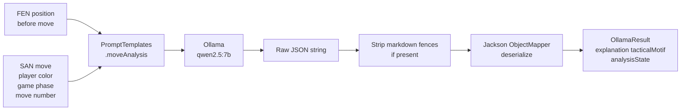

**JSON mode enforcement:** `OllamaAnalysisClient` sends `"format": "json"` in every
request body, activating Ollama's grammar-constrained JSON mode. This forces the model
to produce syntactically valid JSON. The fence-stripping fallback handles the edge case
where the model prepends ` ```json ` despite the format constraint.

---

### Call 2 — Pattern Report (×1 after all games analyzed)

Aggregated statistics across all games are compiled programmatically, then sent to the LLM
to produce a natural language coaching summary.

**What gets aggregated before the LLM call:**

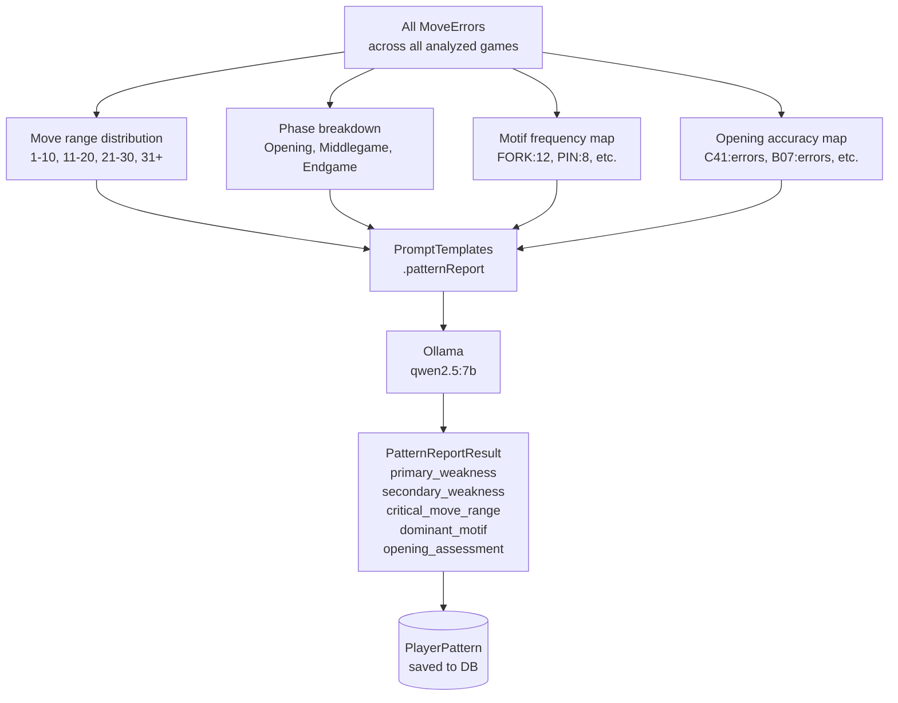

**Example output from the LLM:**
```json
{
  "primary_weakness": "You consistently blunder in endgames after move 30 under time pressure.",
  "secondary_weakness": "Hanging pieces in the middlegame are your most frequent tactical oversight.",
  "tertiary_weakness": "Your opening play in B-series defenses leads to early positional concessions.",
  "critical_move_range": "moves 21-30",
  "dominant_motif": "HANGING_PIECE",
  "opening_assessment": "Strong in C41 Philidor but frequently misplays B07 Pirc structures."
}
```

---

### Call 3 — Training Plan (×1 on demand)

Generated when the user visits the Training Plan page and triggers generation.

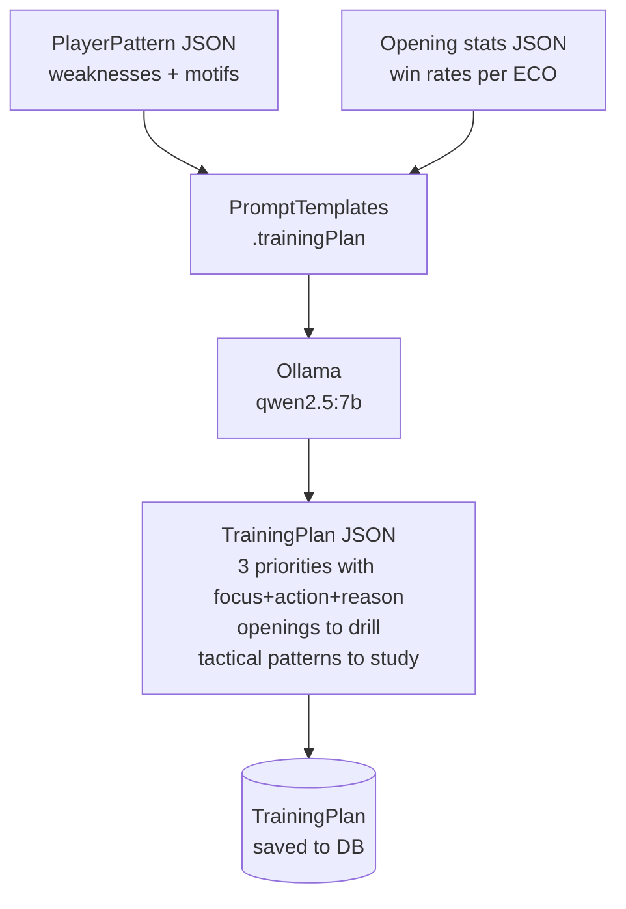

---

## Pattern Aggregation

After all games are analyzed, `PatternAggregator.recompute()` runs in the same async thread:

1. Loads all `MoveError` records for the user's analyzed games
2. Computes statistical distributions (move range, phase, motif) purely in Java
3. Calls Ollama once with the aggregated data
4. Saves `PlayerPattern` to DB (replaces any prior pattern for this user)

The pattern is the foundation for both the Dashboard's "Mistakes by Phase" bars and the
"Today's Focus" banner, and feeds directly into the Training Plan generation.

---

## Insights & Drills

Both features are **pure read-side aggregation** — no new AI calls. They reuse data already
persisted during analysis, so they are effectively free to compute at request time for a
single-user library of a few hundred games.

### Insights (`InsightsService` → `GET /api/insights`)

Loads all games + move errors once and computes, entirely in Java:

| Metric | Derived from |
|---|---|
| Winning-position conversion | `game.max_advantage ≥ 2.0` vs. `game.result` |
| Time-trouble blunder rate | `MoveError.severity = BLUNDER` with `clock_remaining ≤ 30s` |
| Avg time per move | `game.avg_move_seconds` (mean across timed games) |
| Accuracy trend | `game.accuracy` ordered by `played_at`, 10-game rolling average |
| Opponent strength | player vs. opponent rating bucketed at ±50 (`Stronger`/`Even`/`Weaker`) |
| Time-of-day / weekday | `played_at` hour and day-of-week win rates |
| Missed tactics | `MoveError.tactical_motif` frequency |
| Tilt / resilience | win rate in the game after a win vs. after a loss |
| Openings | win rate + avg accuracy grouped by `opening_eco` |

`max_advantage` (highest eval reached, player's perspective) and `avg_move_seconds` (from PGN
`[%clk]` deltas, increment-aware) are computed once in `GameAnalysisTransactionService.analyzeOne`
and stored on the `Game` row.

### Drills (`DrillsController` → `GET /api/drills`)

Every `MoveError` with a non-null `better_move` (engine UCI from MultiPV) is already a complete
puzzle: the stored `fen_position` is the position before the blunder, and `better_move` is the
solution. The endpoint returns a shuffled, capped set; the frontend `Drills` page replays the
position with `react-chessboard` and validates the user's move against the engine move using
`chess.js`. No backend state is added — drills are a projection of existing rows.

---

## Frontend Architecture

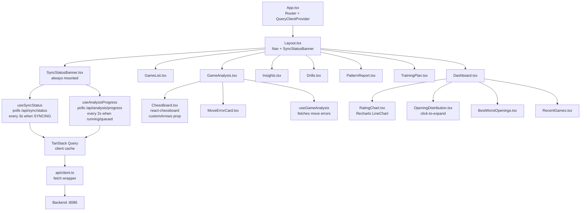

### Key hooks

| Hook | Purpose | Polling |
|---|---|---|
| `useAnalysisProgress` | Polls `/api/analysis/progress` | 2s when `running`, `queued`, or `patternGenerating`; 20s warmup after any mutation |
| `useSyncStatus` | Polls `/api/sync/status` | 3s when `state === SYNCING` or `ANALYZING` |
| `usePatternReport` | Fetches pattern once | No polling |
| `useGameAnalysis` | Fetches move errors for a game | No polling |

### Chess board arrows (GameAnalysis)

When a mistake card is clicked, `chess.js` converts SAN notation to board squares
by replaying the position from the stored FEN:

```
FEN + SAN  →  chess.move(san)  →  { from: 'e2', to: 'e4' }
             (move_played)         red arrow

FEN + SAN  →  chess.move(san)  →  { from: 'd7', to: 'd5' }
             (better_move)         green arrow
```

---

## Backend Architecture

```mermaid
graph TD
    subgraph API["Controllers (REST)"]
        SC[SyncController\nPOST /api/sync\nPOST /api/sync/force-resync\nGET /api/sync/status]
        AC[AnalysisController\nPOST /api/analysis/reanalyze\nGET /api/analysis/progress\nGET /api/analysis/{gameId}]
        DC[DashboardController\nGET /api/dashboard/stats]
        GC[GamesController\nGET /api/games]
    end

    subgraph Services
        ASS[AsyncSyncService\n@Async wrapper]
        SS[SyncService\nsync + forceResync\nsyncQueued flag]
        APO[AnalysisPipelineOrchestrator\n@Async analyzeGames]
        APT[AnalysisProgressTracker\nrunning, queued, patternGenerating\nvolatile + AtomicInteger]
        PA[PatternAggregator\nrecompute]
    end

    subgraph Analysis
        PS[PgnParserService\nchesslib integration]
        PE[PositionEvaluator\nStockfish subprocess]
        MCF[MistakeCandidateFilter\nthreshold filtering]
        OAC[OllamaAnalysisClient\nHTTP to :11434]
        PT[PromptTemplates\nstatic factory methods]
    end

    subgraph Repositories
        GR[GameRepository]
        MER[MoveErrorRepository]
        SHR[SyncHistoryRepository]
        PPR[PlayerPatternRepository]
        TPR[TrainingPlanRepository]
    end

    SC --> ASS --> SS
    SC --> SS
    AC --> APO
    AC --> APT
    APO --> PS & PE & MCF & OAC & PA
    OAC --> PT
    SS & APO & PA --> GR & MER & SHR & PPR
    DC & GC --> GR & MER & PPR
```

### Thread model

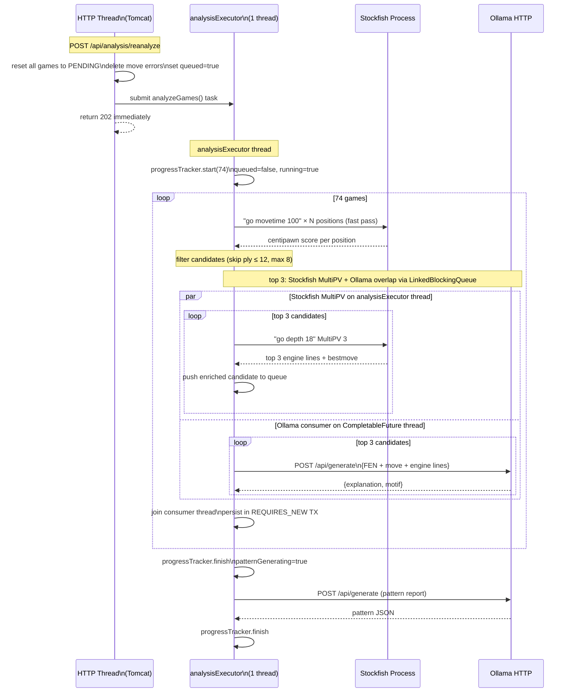

The `analysisExecutor` has `corePoolSize=1, maxPoolSize=1, queueCapacity=50`. The main analysis
thread drives Stockfish (serialized — single subprocess with synchronized methods). Ollama
inference runs on a separate `CompletableFuture.supplyAsync()` consumer thread drawn from the
JVM common pool, overlapping GPU inference with CPU evaluation via a
`LinkedBlockingQueue<Optional<CandidateMove>>` (poison-pill termination). Stockfish and Ollama
no longer block each other: the CPU runs the next MultiPV search while the GPU explains the
previous candidate.

---

## Progress Tracking

`AnalysisProgressTracker` is a Spring `@Component` singleton holding all pipeline state
in-memory via volatile fields and an `AtomicInteger`.

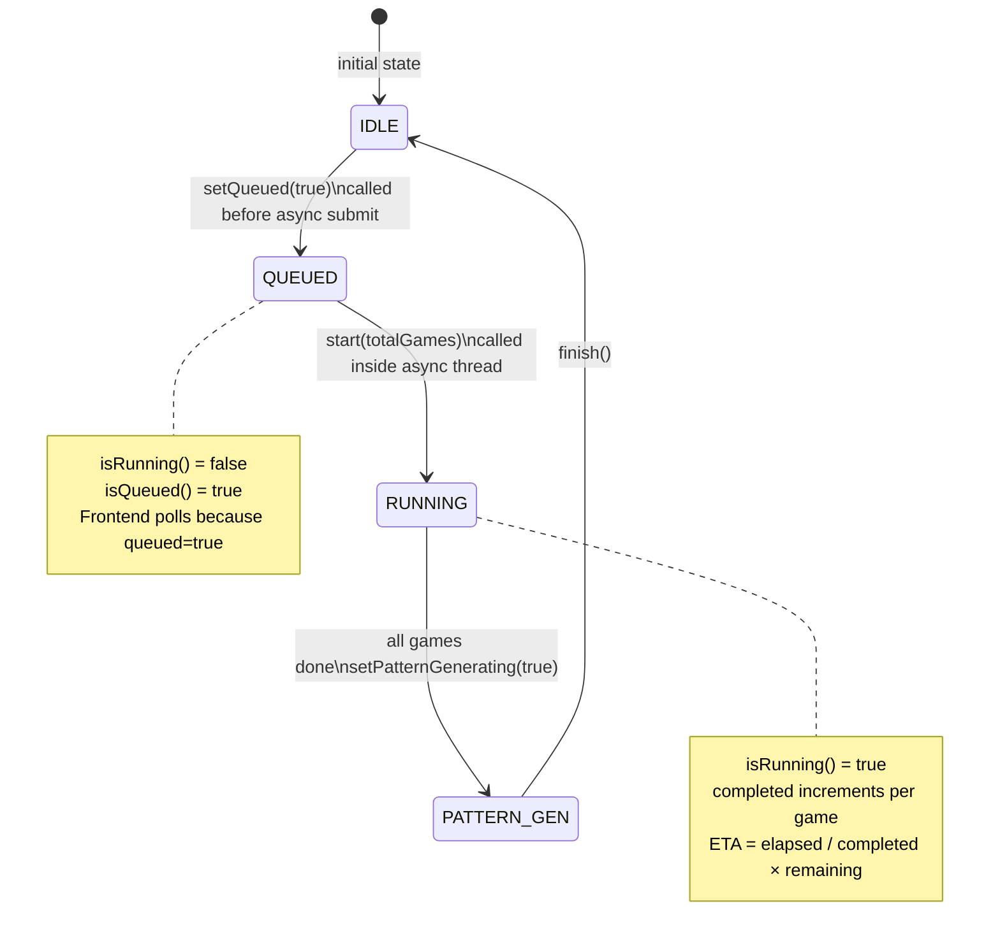

**Why in-memory instead of DB?**

Progress updates happen every few seconds per game. Writing to PostgreSQL on every
increment would add unnecessary DB load and latency. Volatile fields give instant reads
at zero cost.

**DB fallback on restart:** If the server restarts mid-analysis, the in-memory `running`/`queued`
flags reset to false. The `/api/analysis/progress` endpoint has a DB fallback: if the in-memory
state says idle but `PENDING` or `ANALYZING` games exist in PostgreSQL, it reports `queued=true`
so the banner stays active until the user manually triggers **Analyze Pending** to resume.

**The race condition fix:**

Without the `queued` flag, there was a window between the HTTP response returning and
the async thread calling `start()`. The frontend would poll once, see `running=false`,
stop polling, and the progress banner would never appear. Setting `queued=true` synchronously
in the controller (before submitting the async task) means the very first poll after
`onSuccess` already sees activity.

---

## Key Design Decisions

### 1. Two-stage analysis: Stockfish evaluates, Ollama explains

Stockfish is deterministic and fast for numerical evaluation (centipawn scores per position).
Ollama provides the human-readable "why this was a mistake and what to play instead."
Neither alone is sufficient — Stockfish can't explain, Ollama can't reliably calculate.

### 2. Max 3 Ollama calls per game

With 74 games and 7–16 seconds per call, full Ollama coverage would take 2–3 hours.
Limiting to the 3 worst mistakes per game (sorted by centipawn swing) captures the
most instructive moments while keeping total analysis time under 50 minutes.
The remaining mistakes (up to 5) are still stored for pattern counting — just without
natural language explanation (`analysis_state = SKIPPED`).

### 3. Single-threaded analysis executor

Ollama's `qwen2.5:7b` loads 2.4 GB into non-pageable host RAM and 4.0 GB into VRAM.
Running two Ollama calls in parallel would require 8 GB VRAM (unavailable on RTX 3050)
and could exhaust system RAM. One thread serializes all AI work safely.

### 4. No Flyway — `ddl-auto: update`

This is a personal single-user tool, not a multi-environment deployment. Hibernate
auto-creates and migrates the schema on boot. Flyway adds ceremony (migration files,
version tracking) that slows iteration without meaningful benefit at this scale.

### 5. Chess.com sync history table

Rather than comparing every game UUID on every sync, `SyncHistory` records which
year/month combinations have been fetched. Sync checks this first and skips months
already processed — reducing Chess.com API calls from O(all games) to O(new months).
`forceResync` clears these records before syncing to force a complete re-check.

### 6. Per-game transactions via a separate bean

`GameAnalysisTransactionService.analyzeOne()` is annotated `@Transactional(REQUIRES_NEW)` in
a separate Spring bean (required because `@Async` and `@Transactional` cannot coexist safely
on the same bean proxy). Each game commits independently. This means:
- A JVM kill loses only the game in-flight; all prior games remain `ANALYZED`
- On the next startup, `@PostConstruct` in the orchestrator resets any `ANALYZING` games
  back to `PENDING` so they are immediately available for pickup
- Use the **Analyze Pending** button (non-destructive) to resume without re-running
  already-completed games

### 7. Snake_case JSON via Jackson naming strategy

The Spring Boot backend uses `MapperFeature.ACCEPT_CASE_INSENSITIVE_PROPERTIES` and
`PropertyNamingStrategies.SNAKE_CASE`. Java camelCase fields (`percentComplete`)
serialize to `percent_complete` automatically, matching the TypeScript interface
conventions on the frontend without manual `@JsonProperty` annotations.

### 8. Async sync with queued flag

Prior to the refactor, `SyncService.sync()` ran synchronously on the HTTP thread,
blocking it for the duration of all Chess.com API calls (up to several minutes).
Buttons appeared frozen. Moving sync to `@Async` via a separate `AsyncSyncService`
bean (required because `@Async @Transactional` cannot coexist on the same bean)
returns `202 Accepted` immediately. The `syncQueued` volatile flag signals the frontend
before the async thread has had a chance to set `syncing=true`, eliminating the
race condition on the status poll.

---

## REST API Reference

| Method | Path | Description |
|---|---|---|
| `POST` | `/api/sync` | Trigger incremental sync (new months only). Body: `{username, months}`. Returns 202. |
| `POST` | `/api/sync/force-resync` | Force re-fetch last N months from Chess.com. Body: `{months}`. Returns 202. |
| `GET` | `/api/sync/status` | Returns `{state, games_fetched, games_analyzed, games_pending, last_synced_at}` |
| `POST` | `/api/analysis/reanalyze` | Reset all games to PENDING and queue full reanalysis. Returns 200. |
| `POST` | `/api/analysis/analyze-pending` | Queue only PENDING games (non-destructive resume). Returns `{message, games_queued}`. |
| `GET` | `/api/analysis/progress` | Returns `{running, pattern_generating, queued, completed, total, percent_complete, eta_seconds}` |
| `GET` | `/api/analysis/{gameId}` | Returns list of `MoveError` records for a game |
| `GET` | `/api/insights` | Aggregated analytics: conversion, time management, accuracy trend, opponent strength, time-of-day/weekday, missed tactics, tilt, per-opening stats |
| `GET` | `/api/drills?limit=N` | Randomized set of tactics drills built from the player's own mistakes (FEN + engine best move) |
| `GET` | `/api/games` | Paginated game list with filters (status, color, result, time_class) |
| `GET` | `/api/games/{id}` | Full game detail including PGN |
| `GET` | `/api/dashboard/stats` | Aggregated stats: win rates, accuracy distribution, opening performance, rating history |
| `GET` | `/api/patterns` | Current `PlayerPattern` for the configured user |
| `GET` | `/api/training-plan` | Most recent `TrainingPlan` |
| `POST` | `/api/training-plan/generate` | Generate a new training plan from current pattern data |

All endpoints return `application/json`. No authentication — single-user local tool.
Frontend proxies `/api/*` to `http://localhost:8086` via Vite's `server.proxy` config.

---

## Non-Functional Considerations

### Performance

- **Bottleneck:** Ollama inference at 7–16s per call. Analysis throughput is bounded by GPU
  speed, not Java, Stockfish, or the database.
- **Database:** All heavy queries (`MoveError` aggregations, game filtering) are indexed.
  PostgreSQL runs in Docker with data on the D: NVMe partition.
- **Stockfish:** AVX2 binary. Runs at depth 18, which takes milliseconds per position on a
  modern CPU. Not the bottleneck.
- **Frontend:** TanStack Query caches all fetched data client-side. Polling only activates
  when work is in progress (`running || queued || pattern_generating`).

### Reliability

- **Malformed JSON from Ollama:** `OllamaAnalysisClient` catches JSON parse errors and
  retries up to 3 times with exponential backoff (1 s, 2 s). On persistent failure the move
  error is saved with `analysis_state = FAILED` — still counted in pattern aggregation but
  without a natural-language explanation.
- **Chess.com rate limiting (429):** `ChessComApiClient` retries up to 3 times with 10 s / 20 s
  backoff before returning an empty result for that month.
- **Chess.com 304 Not Modified:** The `SyncHistory` deduplication means most months are
  skipped before any HTTP call is made; 304 handling is a secondary safety net.
- **Backend restart mid-analysis:** Each game commits in its own `REQUIRES_NEW` transaction.
  A JVM kill loses only the in-flight game. On next startup `@PostConstruct` in the orchestrator
  resets any `ANALYZING` games to `PENDING`. Use **Analyze Pending** to resume without
  re-running completed games.
- **Stockfish process death:** `StockfishService.ensureAlive()` is called before every
  synchronized operation. If the process has died, it is restarted via `destroy()` + `init()`
  before continuing.

### Privacy

- No game data or user information is sent to any external AI service.
- Chess.com credentials are stored only in `application.yml` (gitignored).
- PostgreSQL runs locally in Docker; no cloud DB.
- Ollama runs fully locally; inference stays on the machine.

---

## Future Considerations

| Feature | Description |
|---|---|
| **Fine-tuned model** | Fine-tune a smaller model (e.g. `qwen2.5:1.5b`) on chess coaching data using Unsloth. Would reduce inference time from 7–16s to ~2s, cutting total analysis time from 50 min to ~10 min. |
| **Opening Trainer** | Integrate a spaced-repetition opening drill module. Pattern report already identifies weak openings by ECO code — this would close the loop by generating drill positions from those lines. |
| **Opponent analysis** | Extend sync to fetch opponent's recent games for detected weaknesses; useful for pre-game preparation. |
| **Time pressure deep-dive** | Currently tracked as a boolean flag per move (clock < 30s). Future: correlate time pressure with mistake rate per opening/phase to identify specific situations where time management breaks down. |
| **Analysis versioning** | Tag each MoveError with an analysis version (model + depth + prompt hash). When the model or prompt changes, stale explanations can be detected and selectively re-run without a full re-analysis. |

---

## Hardware Reality

The system is tuned for this specific hardware configuration:

| Component | Spec | Role in Praxis |
|---|---|---|
| CPU | AMD Ryzen 7 7735HS (8c/16t) | Stockfish evaluation, Spring Boot |
| RAM | 24 GB DDR5 4800 MT/s | Ollama host model buffer (2.4 GB pinned) + JVM + OS |
| GPU 0 | AMD Radeon 680M (iGPU) | Display only |
| GPU 1 | NVIDIA RTX 3050 Laptop 4 GB | Ollama CUDA inference (4 GB VRAM fully used) |
| Storage | Micron 2500 NVMe 954 GB (C: + D: same disk) | PostgreSQL (Docker WSL2 on D:), page file on D: |

**Memory pressure during analysis:**

```
RTX 3050 VRAM (4 GB):     ████████████████████ 100% — model GPU layers
Host RAM — model buffer:  ████████░░░░░░░░░░░░  2.4 GB pinned non-pageable
Host RAM — system + JVM:  ████████████░░░░░░░░  ~19 GB in use during analysis
Page file (D: drive):     grows to ~23 GB to back committed virtual memory
```

The page file was moved from C: to D: to prevent C: from filling during sustained
analysis sessions (Ollama's pinned RAM forces Windows to page other processes to disk).
Both partitions are on the same physical NVMe SSD, so performance is identical.

---

## Flow Summary

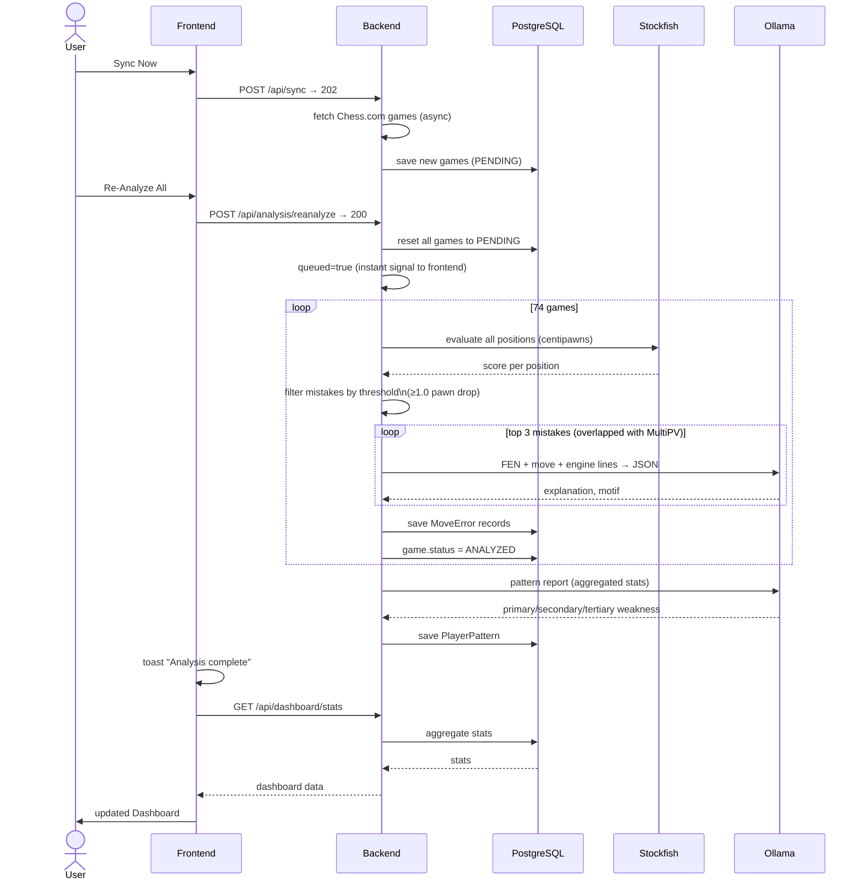

---

## How It All Connects (High Level)

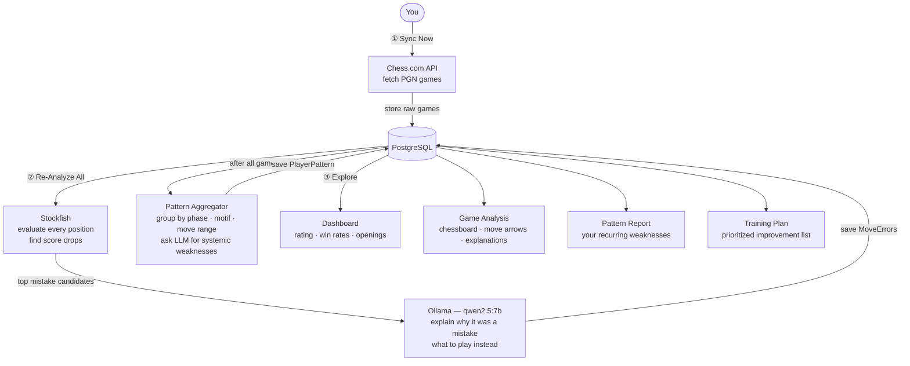
