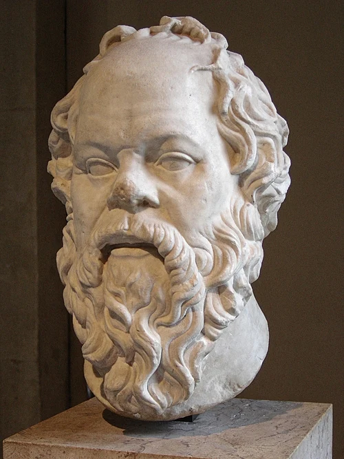
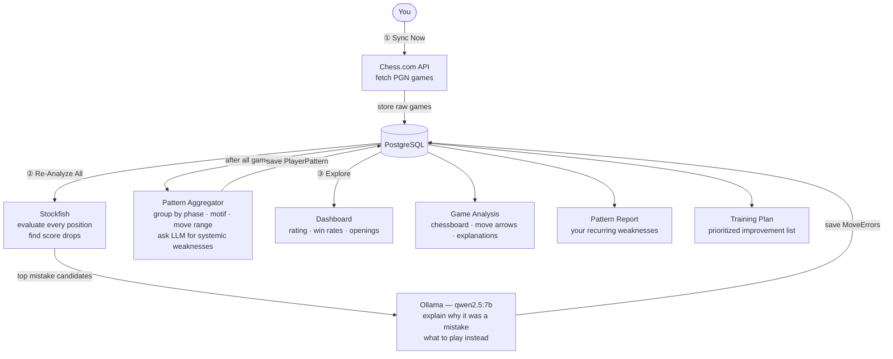

# Praxis-Chess



A personal, fully offline chess analytics and improvement system. Connect your Chess.com account, let the AI analyze your games, identify your recurring weaknesses, and generate a training plan tailored to your actual play — not generic advice.

Built with **Java 26 + Spring Boot 3.5**, **PostgreSQL**, **Stockfish**, **Ollama (local LLM)**, and **React**. No cloud AI. No deployment. Runs entirely on your machine.

---

## What It Does

### Dashboard

Your chess at a glance — rating trend over time, win/loss/draw breakdown, opening distribution, and accuracy stats across your recent games.

### Game Analysis

Select any fetched game and get move-by-move coaching. Every mistake is flagged with its severity (blunder, mistake, inaccuracy), the better move, and a plain-English explanation of _why_ — powered by Stockfish evaluation + local LLM.

### Pattern Report

Cross-game aggregation. Instead of per-game feedback, this tells you what _keeps_ happening: which move range you blunder in most, which tactical motifs catch you repeatedly, and where your opening preparation breaks down.

### Training Plan

The AI reads your Pattern Report and generates a prioritized, concrete improvement list — specific openings to drill, tactical patterns to study, positional habits to fix. Regenerates on demand.

---

## Tech Stack

| Layer        | Technology                  | Version           |
| ------------ | --------------------------- | ----------------- |
| Backend      | Java + Spring Boot          | Java 26, SB 3.5.3 |
| Chess engine | Stockfish (AVX2 binary)     | —                 |
| Local LLM    | Ollama + `qwen2.5:7b`       | —                 |
| Database     | PostgreSQL (Docker)         | 17                |
| PGN parsing  | chesslib (`bhlangonijr`)    | 1.3.3             |
| Data source  | Chess.com Public API        | free, no key      |
| Frontend     | React + TypeScript + Vite   | React 18          |
| Server state | TanStack Query              | v5                |
| Charts       | Recharts                    | —                 |
| Chess board  | react-chessboard + chess.js | —                 |

---

## How It All Connects



> For low-level internals : thread model, data model, AI reasoning flow, design decisions, see [ARCHITECTURE.md](ARCHITECTURE.md)

---

## How Analysis Works

Analysis runs in three stages, entirely offline:

**Stage 1 — Stockfish evaluates every position**
Each move's FEN is sent to a local Stockfish subprocess (depth 18). Centipawn score drops ≥ 1.0 pawn are flagged as mistake candidates (max 8 per game).

**Stage 2 — Ollama explains the worst mistakes**
The top 3 candidates (by severity) are sent to `qwen2.5:7b` via Ollama with a structured JSON prompt. The LLM explains _why_ the move was a mistake and what to play instead.

```json
{
  "severity": "BLUNDER",
  "better_move": "d5",
  "explanation": "Allows Bxf7+ winning the exchange. d5 contests the center and maintains equality.",
  "tactical_motif": "HANGING_PIECE"
}
```

**Stage 3 — Pattern aggregation**
After all games are analyzed, error statistics (by phase, move range, motif, opening) are compiled and sent to the LLM once to identify systemic weaknesses across your full game library.

Ollama is called with `"format": "json"` (grammar-constrained mode) — output is always parseable, never a wall of text.

---

## Prerequisites

- **Java 26+** (JDK 26)
- **Docker** (for PostgreSQL)
- **[Ollama](https://ollama.com)** installed and running
- **Stockfish** binary (AVX2 build recommended)
- **Node.js 18+** (frontend)

---

## Getting Started

### 1. Clone the repository

```bash
git clone https://github.com/Tanmay-Anand/praxis-chess.git
cd praxis-chess
```

### 2. Start PostgreSQL via Docker

```bash
cd backend/infra/dev-postgresql
docker compose up -d
```

### 3. Pull the LLM model

```bash
ollama pull qwen2.5:7b
```

### 4. Configure the application

```bash
cp backend/src/main/resources/application.example.yml \
   backend/src/main/resources/application.yml
```

Edit `application.yml` with your values:

```yaml
spring:
  datasource:
    url: jdbc:postgresql://localhost:5432/praxis_chess
    username: praxis_chess_user
    password: your_password

praxis-chess:
  ollama:
    base-url: http://localhost:11434
    model: qwen2.5:7b
  chess-com:
    username: your_chess_com_username
  stockfish:
    path: /path/to/stockfish
```

### 5. Run the backend

```bash
cd backend
./mvnw spring-boot:run
# Runs on http://localhost:8086
```

### 6. Run the frontend

```bash
cd frontend
npm install
npm run dev
# Opens on http://localhost:5173
```

---

## Project Structure

```
praxis-chess/
├── backend/
│   ├── src/main/java/com/praxis/
│   │   ├── api/                    # REST controllers
│   │   ├── config/                 # AppProperties, async executor config
│   │   ├── domain/                 # JPA entities + enums
│   │   ├── dto/                    # Request / response DTOs
│   │   ├── pipeline/               # AnalysisPipelineOrchestrator + ProgressTracker
│   │   ├── repository/             # Spring Data JPA repositories
│   │   └── service/
│   │       ├── ai/                 # OllamaAnalysisClient, PromptTemplates
│   │       ├── analysis/           # PGN parser, Stockfish evaluator, mistake filter
│   │       └── chesscom/           # Chess.com API client, SyncService, AsyncSyncService
│   └── src/main/resources/
│       ├── application.example.yml # Safe template (committed)
│       └── application.yml         # Your secrets (gitignored)
├── frontend/
│   └── src/
│       ├── api/                    # API client + TypeScript types
│       ├── components/             # SyncStatusBanner, ChessBoard, charts
│       ├── hooks/                  # useAnalysisProgress, useSyncStatus
│       └── pages/                  # Dashboard, GameList, GameAnalysis, PatternReport, TrainingPlan
└── ARCHITECTURE.md                 # Full design decisions + Mermaid diagrams
```

---

## Roadmap

- [x] Chess.com API integration + game sync
- [x] PGN parsing pipeline (chesslib)
- [x] Stockfish position evaluation
- [x] Structured Ollama analysis engine (JSON mode)
- [x] Async sync + live progress banner with ETA
- [x] Game Analysis page (chessboard + move arrows)
- [x] Pattern aggregation engine
- [x] Training plan generator
- [x] Dashboard with rating chart + opening breakdown
- [ ] Per-game transaction commits (resume after JVM kill)
- [ ] Opening drill integration
- [ ] Fine-tuned smaller model for faster inference

---

## Why Fully Offline?

Most AI chess tools require uploading your games to cloud services. Praxis-Chess takes a different approach.

Every analysis runs locally on your machine. Stockfish evaluates your positions, Ollama generates explanations and training plans, and PostgreSQL stores your data. Nothing is sent to external AI providers, and no account, subscription, or internet connection is required after your games have been synced.

The only outbound request is to the Chess.com Public API to download games from your own public profile. After that, every evaluation, pattern report, and training recommendation happens entirely offline.

This approach provides:

- **Privacy by default** : your games, evaluations, and improvement history never leave your computer.
- **No cloud dependency** : keep analyzing games even without an internet connection.
- **No API costs or rate limits** : run as many analyses as you want using your own hardware.
- **Full ownership of your data** : your database, engine, and AI model are all under your control.
- **Transparent architecture** : every component, from Stockfish to the local LLM, is open and inspectable.

Praxis-Chess is designed as a personal chess improvement system, not a cloud service. You own the data, you run the analysis, and you decide when and how it operates.

---

## License

MIT
